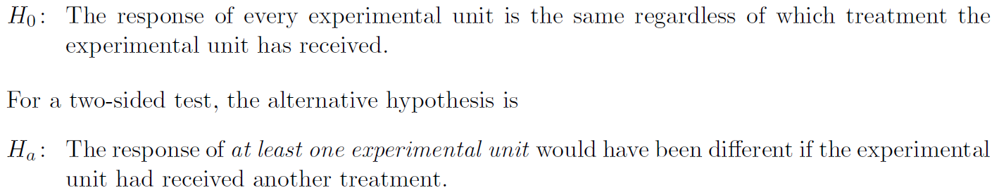
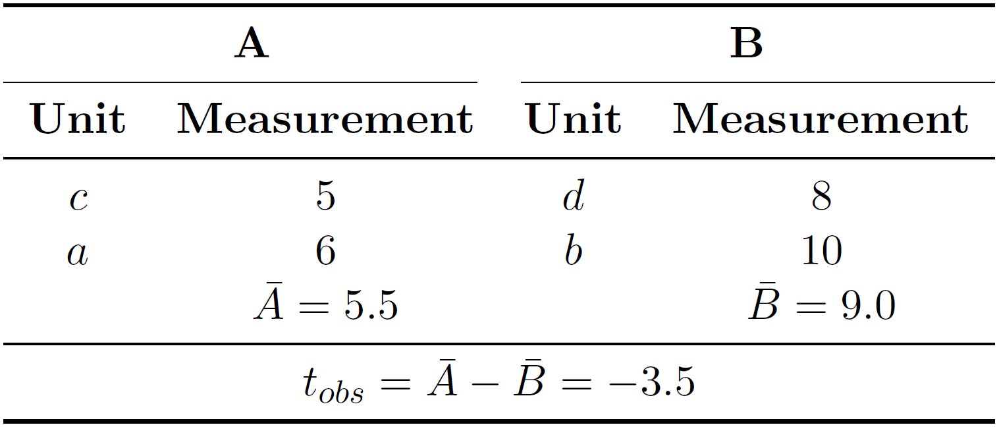
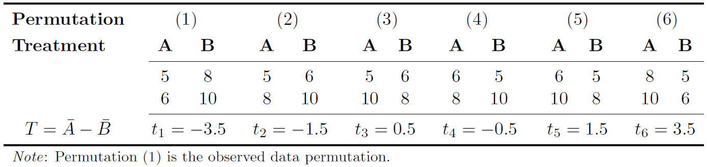
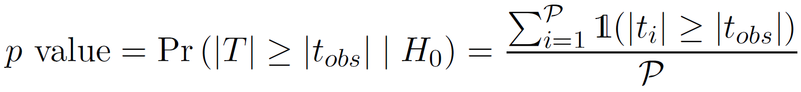

# Randomization tests for two-sample comparison

This Python package implements a randomization test for the comparison of two
independent groups as described in:
> E. Edgington and P. Onghena, Randomization Tests, 4th ed.<br/>
> Boca Raton, FL: Chapman & Hall/CRC, Taylor & Francis Group, 2007.

*Note*: As for the randomization test, it is assumed that the data are originated from a controlled experiment.


## Implementation

### Requirements

* Python 3


### Highlights

This implementation demonstrates various concepts of advanced Python programming
such as:

* *Packaging*: Creation of a Python package, a collection of Python modules structurally organized, to allow for an easy re-usability of the provided functionality, which is the `randtest()` function.

* *Test-Driven Development (TDD)*: Creation of reliable code with the intended functionality (see `tests/`).

* *Functional Programming*: Passing functions to arguments of `randtest()`,
i.e. `mct` and `tstat` (see below).
The former allows passing a user-defined function for the measure of central tendency computed in the test statistic (default: `statistics.mean`).
The latter permits passing a user-defined function for the computation of the test statistic. By default, the difference between measures is computed: `mct(data_group_a) - mct(data_group_b)`.

* *Object-Oriented Programming (OOP)*: The `randtest()` function, for example, returns an instance of the class `randtest.base.RandTestResult`, holding all relevant information of the test result.

* *Generators*: The proper use of Python generators allows for a scalable and memory efficient implementation (i.e., results are processed as they come in).
*Note*: If a user-defined function is passed to `mct`, it requires handing a generator object.

* *Multiprocessing*: Using the `num_jobs` argument permits carrying out the computation over multiple CPUs. 
*Note*: Because of it, `randtest()` must be executed below `if __name__ == '__main__':` if a user-defined function is passed to `mct` or `tstat`.

* *Command line interface (CLI)*: Setting up entry points to make functionality available on the CLI.

## Basic example

This example is taken from:
> E. Stripling, "Distribution-free statistical inference for the comparison of
> central tendencies," <br/>
> MSc thesis, Dept. LStat, KU Leuven, Leuven, Belgium, 2013.

In a randomization test, the hypotheses are as follows:
<p align="center">
    
</p>

Now, suppose we have two treatment groups, __A__ and __B__, and four
experimental units (designated as _a_, _b_, _c_, and _d_), which are randomly
assigned to the two treatment groups. We conduct the experiment and measure the
 response of the experimental units. Assume we observed the following data
<p align="center">
    
</p>

Our test statistic of interest is the difference between arithmetic means,
where _t<sub>obs</sub>_ is the observed test statistic value. 
For carry out the randomization test, permute the data and compute the test 
statistic for each data permutation, which creates the _reference distribution_.
In this example, the _systematic_ approach is used, meaning that all possible
data permutations are generated.

<p align="center">
    
</p>

Based on the data permutations, the two-sided p value can be computed:

<p align="center">
    
</p>

That is, simply count how often _T_ (in absolute sense) is equal to or larger than |_t<sub>obs</sub>_| (i.e., number of successes), and divide it by the number of data permutations. 
In this example, the exact two-sided p value equals 2/6 or 33%.

Use the `randtest` function to  carry out the analysis in Python.
Note that `num_permutations = -1` specifies the systematic approach.

```{python}
>>> from randtest import randtest
>>> x = (5, 6)
>>> y = (8, 10)
>>> result = randtest(x, y, num_permutations=-1)
>>> print(result)
<class 'randtest.base.RandTestResult'>
Method = Systematic
Alternative = two_sided
MCT(data of group A) = 5.5
MCT(data of group B) = 9
Observed test statistic value = -3.5
Number of successes = 2
Number of permutations = 6
p value = 0.333333
seed = None
```

The systematic approach, however, quickly becomes infeasible if the sample size
increases. 
In this circumstances, the _Monte Carlo randomization test_ can be
used to approximate the p value. 
It is carried out by default with a positive integer for `num_permutations = 10000`.

```{python}
>>> from randtest import randtest
>>> x = (5, 6)
>>> y = (8, 10)
>>> result = randtest(x, y, num_jobs=2, seed=0)
>>> print(result)
<class 'randtest.base.RandTestResult'>
Method = Monte Carlo
Alternative = two_sided
MCT(data of group A) = 5.5
MCT(data of group B) = 9
Observed test statistic value = -3.5
Number of successes = 3312
Number of permutations = 10000
p value = 0.3312
seed = None
```

We can approximate the p value to an arbitrary degree, simply by increasing the number of permutations.


## User-defined function

By default, `randtest()` computes the difference between arithmetic means.
If another measure of central tendency is of interest, one can pass a user-defined function.
Say, we are interested in the trimmed mean.
We first need to define it:

```{python}
def trimmed_mean(data: GeneratorType, trim_percent=.2) -> float:
    """Trimmed mean"""
    data_sorted = tuple(sorted(data))
    num_data_pnts = len(data_sorted)
    lowercut = int(num_data_pnts * trim_percent)
    uppercut = num_data_pnts - lowercut
    data_trimmed = data_sorted[lowercut:uppercut]
    return sum(data_trimmed) / len(data_trimmed)
```

Then, we can pass it to `randtest()` with `mct=trimmed_mean`.

Similarly, we proceed if we want to pass a user-defined function for the test statistic.
For example, the difference between the measures of central tendencies can be implemented as follows:

```{python}
def test_statistic(
        data_group_a: GeneratorType,
        data_group_b: GeneratorType,
        mct: FunctionType) -> float:
    """Compute test statistic: Difference between MCTs"""
    return mct(data_group_a) - mct(data_group_b)
```

We then simply pass it to `tstat=test_statistic`.


## Smart drug example
To illustrate randomization tests on a more realistic example, consider the
"smart drug" example described in [(Online)](http://dx.doi.org/10.1037/a0029146):
> J. K. Kruschke, "Bayesian estimation supersedes the t test."
> *Journal of Experimental Psychology: General*, <br/>
> vol. 142, no. 2, pp. 573-603, May 2013. 

In which, the research question is: _Do people who take the smart drug perform_
_better on the IQ test than those in the control group?_
In the experiment, 47 people received the supposedly IQ-enhancement drug
(group A), and 42 people received an placebo (group B).
Data have been taken from
[here](https://github.com/strawlab/best/blob/master/examples/smart_drug.py).

For this example, two randomization test are carried out: (1) one in which the
test statistic is the difference between arithmetic means, and (2) in which the
test statistic is the difference between trimmed means (20% on each side) in
order to account for the outliers in the data.


```{bash}
$ make example_smart_drug 
python3 examples/smart_drug.py
[...]
MCT = Arithmetic Mean
<class 'randtest.base.RandTestResult'>
Method = Monte Carlo
Alternative = two_sided
MCT(data of group A) = 101.915
MCT(data of group B) = 100.357
Observed test statistic value = 1.55775
Number of successes = 128
Number of permutations = 1000
p value = 0.128
seed = 0

MCT = 20% Trimmed Mean
<class 'randtest.base.RandTestResult'>
Method = Monte Carlo
Alternative = two_sided
MCT(data of group A) = 101.586
MCT(data of group B) = 100.538
Observed test statistic value = 1.04775
Number of successes = 10
Number of permutations = 1000
p value = 0.01
seed = 0
```

For (1), the p value equals 12.8%, meaning that one does not reject the null
hypothesis at a significance level of 5%. 
However, this test is naive, since the outliers cause a distortion of the 
arithmetic means. In (2), the test statistic is robuster against extreme 
observations, resulting in p value of 1%.
Thus, with the more reasonable test statistic, the null hypothesis is rejected.
One can therefore conclude that the response of at least one person would have
been different if (s)he had received the other treatment. 
Note that the rejection of the null hypothesis with (2) is in line with the 
conclusion of the robust Bayesian estimation approach carried out by Kruschke.
